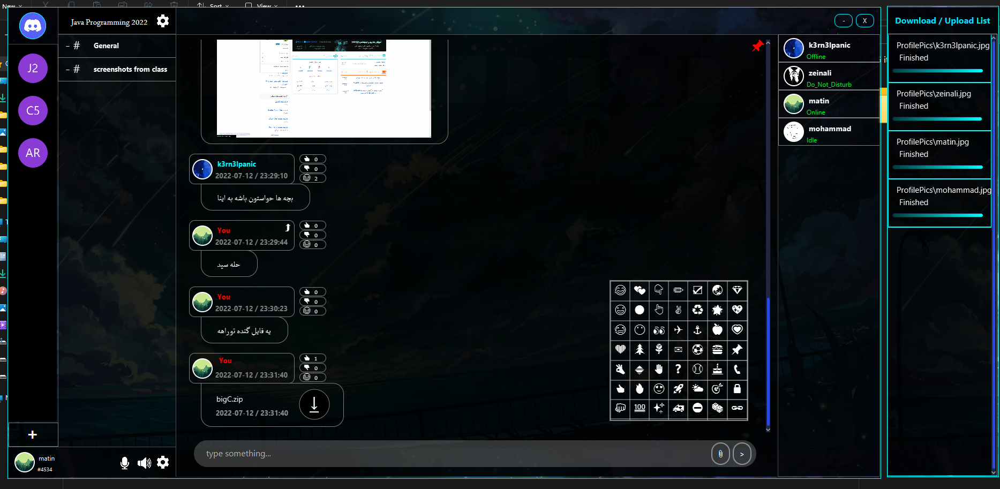
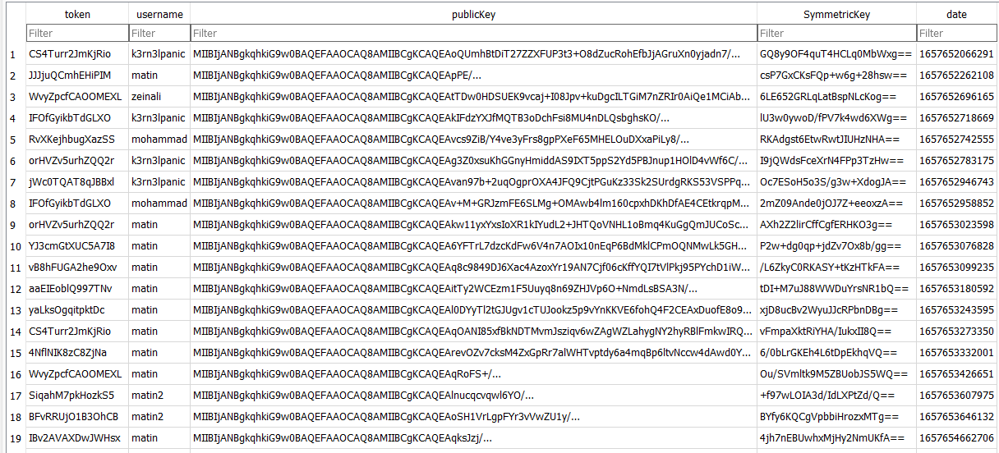
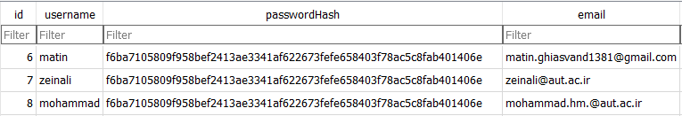
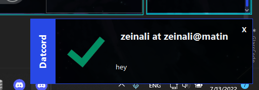

# Datcord-Java
Datcord is a java based (javafx) messenger similar to discord which gives users ability to create servers and channels (or direct chats) and make direct and group calls or screenshare.
It uses Encryption (much like ssl) and all connections with server is encrypted.



## Encryption
First Server chooses a symmetric key , then both server and client generate a pair of private and public key and send it to each other, then server encrypts the symmetric key with client's public key and sends it to client.
the client then decrypts the encrypted key and gets the symmetric key , then all the data transfered between client and server , will be encrypted by the symmetric key that server randomly generated for this client.


## DataStoring
It uses sqlite3 as its database and stores information in them , it stores passwords in hashed form (sha256).


## Notification
It has a notification popup for incomming messages to inform user.



## Call
Either users can join voice channels , or join Screenshare , or directly call a user in app

## Emojies
It supports 80 different emojies and users can send them either from the emoji box , or use the style ":emojiname:"
List of emoji names : 
```bash
laugh,smile,cry,heart,ok,thumb,fist,angry,tick,cross,moon,twoheart,circle,mouthless,tree,square,fire,hundred,star,poop,pointright,pointleft,pointdown,pointup,eyes,rose,palm,hearteyes,sparkles,plus,minus,divide,snowflake,pencil,victoryhand,airplane,mail,questionmark,rocket,ambulance,nosmoking,bike,walking,houglass,tickbox,recycle,anchor,soccerball,baseball,sunbehindcloud,noentry,church,tent,wave,volcano,earth,glowingstar,apple,hamburger,birthdaycake,dart,dice,chick,penguin,thumbsdown,clappinghands,gem,sparklingheart,growingheart,pushpin,telephone,lock,linkchain,underage,pokerface,suprisedface,shower
```

## Verification
It will send an email verification when user tries to signup.

## Demo Images and videos
